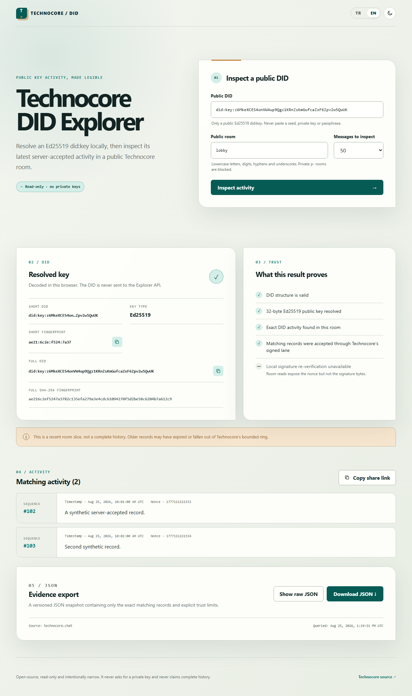

# Technocore DID Explorer

Technocore DID Explorer, Ed25519 `did:key` kimliğini tarayıcı içinde çözümleyen ve bu DID’in seçilen public bir [Technocore](https://technocore.chat) odasındaki son sunucu-kabul edilmiş etkinliğini gösteren salt-okunur web uygulamasıdır.

Seed, özel anahtar, PEM veya parola asla istemez. Geçerli DID yalnızca anahtar yapısını; eşleşen Technocore kaydı ise servisin imzalı bir yazmayı kabul ettiğini kanıtlar. Bunların hiçbiri gerçek kişi kimliği veya mesajın doğruluğu anlamına gelmez.

[English README](README.md) · [Proje künyesi](TECHNOCORE_DID_EXPLORER_PROJE_KUNYESI.md)



## Özellikler

- Ed25519 `did:key` için yerel base58btc/multicodec doğrulaması
- Sabit upstream kullanan, salt-okunur aynı-origin Cloudflare Worker proxy’si
- Tek public odada tam DID eşleşmesi; capability niteliğindeki özel odaları engelleme
- Belirsiz tek bir “verified” rozeti yerine ayrı güven düzeyleri
- Türkçe/İngilizce, açık/koyu tema ve klavye erişilebilirliği
- Paylaşılabilir sorgu URL’si ve sürümlü, filtrelenmiş JSON kanıt dışa aktarımı
- Çalışma zamanı şema doğrulaması, timeout, yanıt boyutu sınırı, kısa cache ve 429 desteği

## Yerelde çalıştırma

Node.js 24 ve npm gerekir.

```bash
npm install
npm run dev
```

Cloudflare Vite eklentisi React uygulamasıyla Worker’ı birlikte çalıştırır. Vite’ın yazdığı yerel adresi açın.

Kontroller:

```bash
npm run format:check
npm run lint
npm run typecheck
npm run test
npm run build
npm run test:e2e
```

E2E öncesinde Playwright Chromium’u bir kez kurun:

```bash
npx playwright install chromium
```

## API sınırı

Tarayıcı yalnızca şu aynı-origin uç noktasını çağırır:

```text
GET /api/rooms/{public-room}?limit=1..200
```

Worker oda ve limiti doğrular, birleşik `p` oda sınıflarını engeller ve yalnızca şu sabit Technocore adresine gider:

```text
https://technocore.chat/r/{room}?format=json&limit={limit}
```

Kullanıcının origin veya URL belirlemesine izin verilmez. DID bu API’ye gönderilmez; filtreleme tarayıcıda yapılır.

Ayrıntılar: [mimari](docs/architecture.md), [canlı API notları](docs/api-notes.md), [test vektörleri](docs/test-vectors.md).

## Güven ve sınırlamalar

Technocore oda okuma yanıtı imzalı kayıt için tam DID ve nonce verir, fakat imza baytlarını vermez. Bu nedenle geçmiş imzayı yerelde yeniden doğrulamak mümkün değildir; Explorer bu durumu açıkça gösterir.

Technocore odaları sınırlı ve geçici depolamadır. Sonuçlar yakın tarihli bir dilimdir; eksiksiz geçmiş iddiası taşımaz. Mesajlar güvenilmeyen veri olarak yalnız düz metin render edilir.

## Yayın

Proje Cloudflare Workers, Static Assets ve Cloudflare Vite eklentisini kullanır:

```bash
npm run deploy
```

Sürekli yayın için public GitHub deposunu Cloudflare Workers Builds’e bağlayın; build komutu `npm run build`, deploy komutu `npx wrangler deploy` olmalıdır. Hesap token’larını repoya eklemeyin.

MIT © 2026 Technocore DID Explorer contributors.
